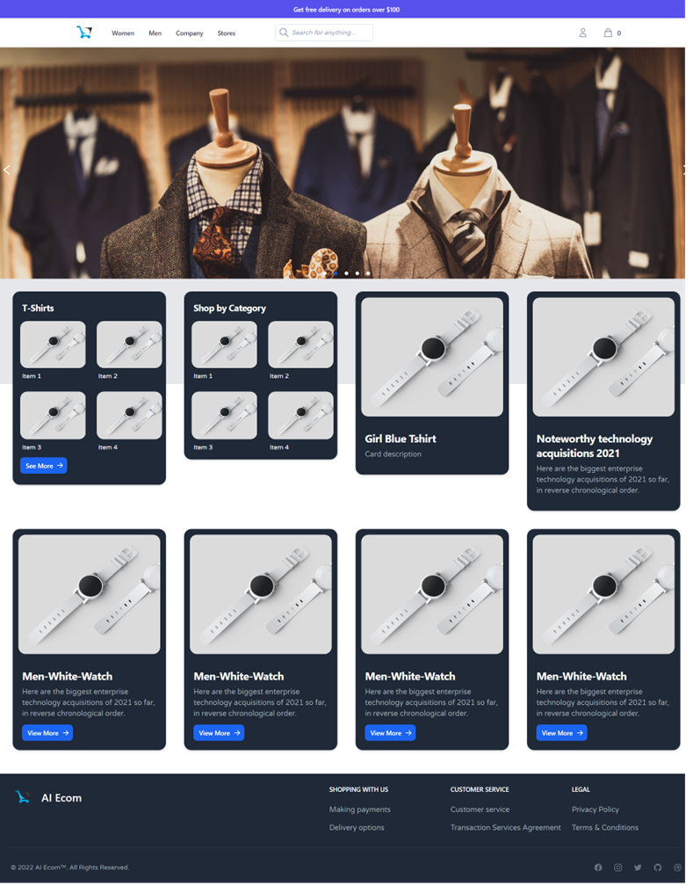
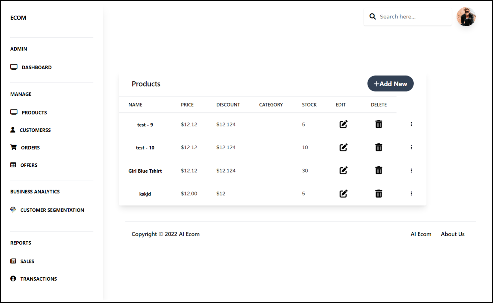
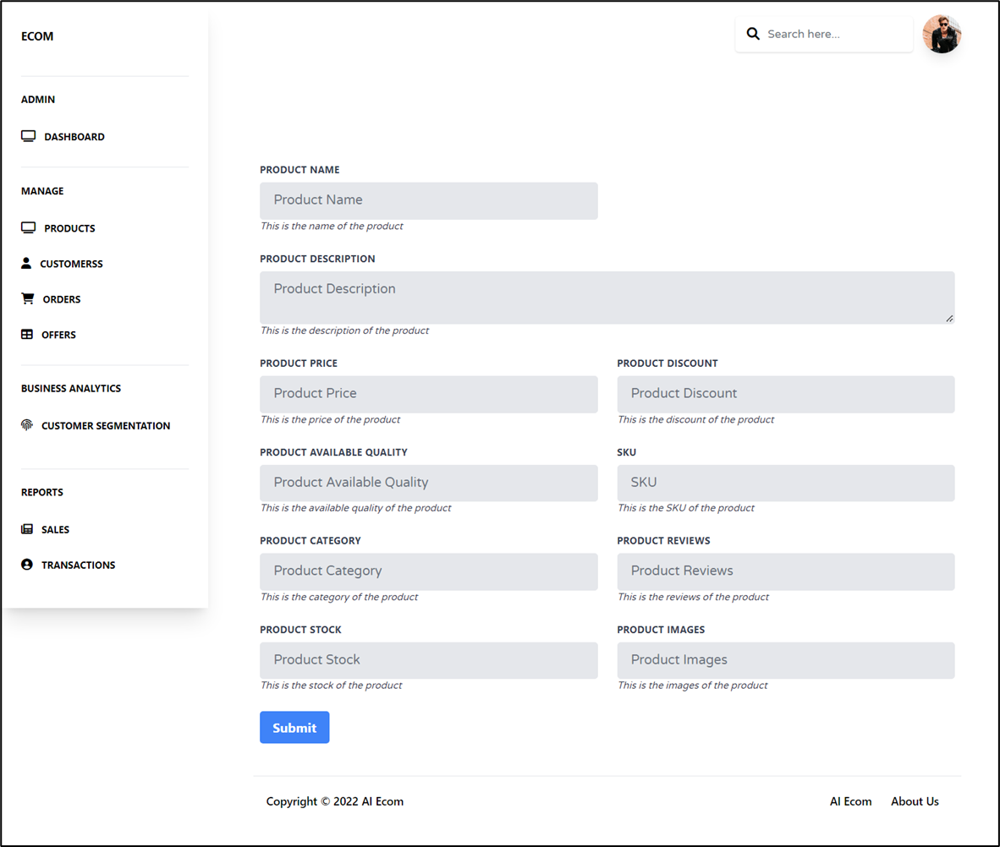
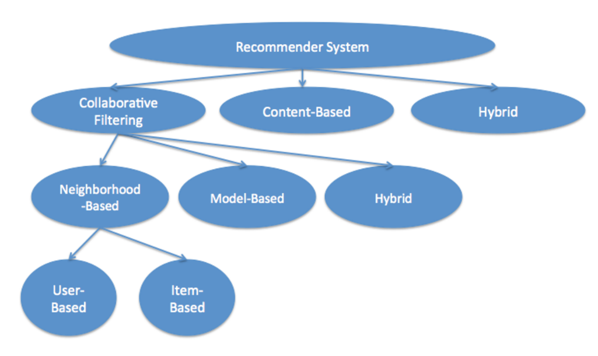
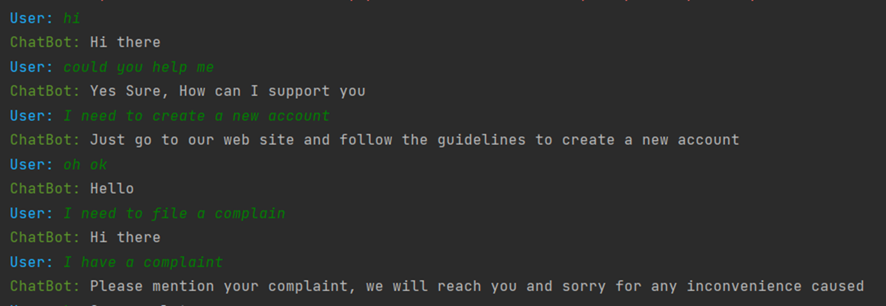
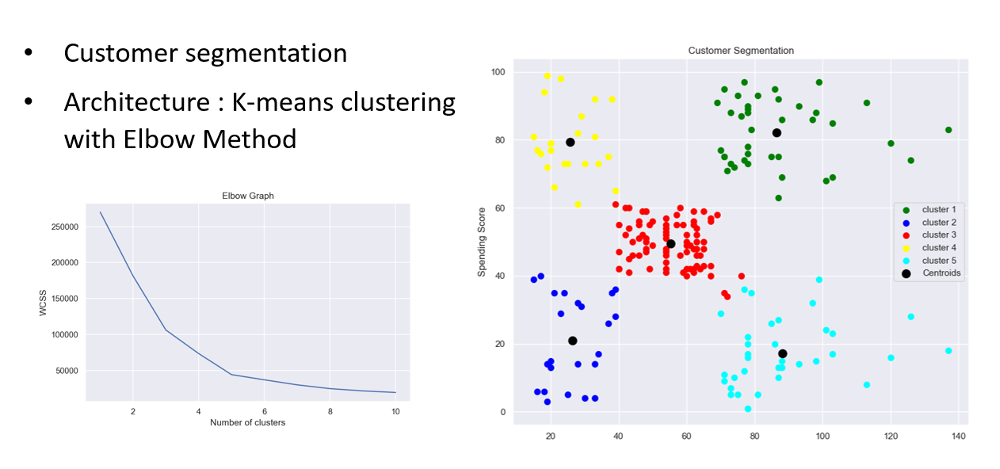

# AI Ecom 

This is a e-commerce platform build with AI.

This system consist of three parts:
1. [Customer End](https://github.com/timnirmal/Ecom-Customer) 
2. [Shop/Admin End](https://github.com/timnirmal/Ecom-Customer-Shop-End) 
3. [Python Backend](https://github.com/timnirmal/EcomPyAPI)
   1. Product Recommendation
   2. Customer Segmentation
   3. Business Analysis

## Customer End

The customer end is a web application that allows customers to browse products, add them to their cart, and checkout.



Features:
- Browse products
- Add products to cart
- Checkout
- View orders, wishlist, and cart
- View product recommendations
- Fully Customizable and Dynamic Components
- Fully Responsive
- SEO optimized


## Shop/Admin End

The shop end is a web application that allows shop owners to manage their products, orders, and customers.






Features:
- Manage products, orders, and customers
- Realtime
- 


## Python Backend

The python backend is a python script that runs in the background and performs various tasks created with FastAPI.
          
### Product Recommendation


Architecture
Content-Based : TF-IDF
Collaborative Filtering : Model Based | Latent factor model (SVD - Singular Value Decomposition)
Hybrid version is used by combining these two models in weight CF : BF = 100 : 1



Closed domain, Retrieval based, and multi-class classification chat-bot.

## Chatbot



## Customer Segmentation



# Tech Stack

- NextJS
- TailwindCSS
- Supabase
- FastAPI
- Vercel
- Heroku
- Tensorflow/Keras
- Scikit Learn
- Postman

# Installation

Clone the repository

```bash
  git clone
```

Go to the project directory

```bash
  cd Ecom-Customer
```

Install dependencies

```bash
  npm install
```

Start the server

```bash
  npm run dev
```

